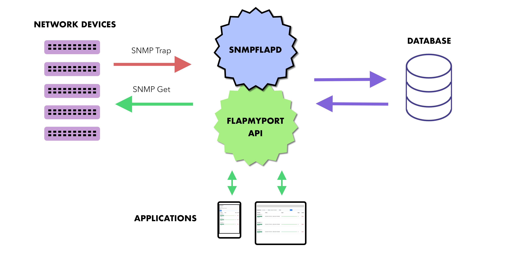

# FlapMyPort Docker

Dockerized FlapMyPort monitoring system bundle

## What is FlapMyPort

FlapMyPort is a fast and easy monitoring system with the following components

**snmpflapd** — A high performance daemon that collects SNMP Link UP/DOWN traps

**flapmyport_api** — API that shows the data collected by the snmplapd

**iOS client** — A native iOS client with handy UX

**Web client** — Responsve web application for desktop and mobile devices

**AppleTV client** — Client for network enthusiasts with AppleTV

## Quick Start

### 1. Run FlapMyPort
`docker-compose up -d`

- Web client will be available by the following URL: `http://<ip_address>/`
- API URL for clients is `http://<ip_address>/api`

### 2. Configure network devices

After that you need to configure your network devices to:
- send SNMP traps to the FlapMyPort server
- Answer to SNMPGet from **snmpflapd**

> Note that your network devices must be accessable from the server, 
> as snmpflapd strikes back with snmp get queries to fetch information about hostname.

You're all set!

---

## Custom settings

Edit `.env` file if you need custom SNMP community or nginx configuration.

---
*And may a stable network be with you!*
